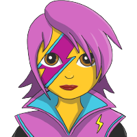

<p align="center">
  <a href="https://www.gatsbyjs.org">
    
  </a>
  <a href="https://tailwindcss.com">
    
  </a>
  <a href="https://emotion.sh">
    
  </a>
</p>
<h1 align="center">
  Gatsby + Tailwind + Emotion Starter (extended)
</h1>

Get started quickly with this Gatsby + Tailwind + Emotion starter. It has some 🔋 included, which I personally use in almost 100% of my projects.

## ❗️ Mention

This starter wouldn't been possible without [this bare-bones starter](https://github.com/pauloelias/gatsby-tailwind-emotion-starter). This project is essentially build upon the starter of [@pauloelias](https://github.com/pauloelias) and just extends it (therefore the _'-extended'_) by adding some more functions to make it 🔋 included for my pruposes.

## 🚀 Quick start

1.  **Create a Gatsby site.**

    Use the Gatsby CLI (via npx) to create a new site, specifying the `gatsby-tailwind-emotion-starter-extended` starter.

    ```
    npx gatsby new my-gatsby-tailwind-emotion-starter-extended https://github.com/pinutz23/gatsby-tailwind-emotion-starter-extended
    ```

2.  **Start developing.**

    Navigate into your new site’s directory and start it up.

    ```shell
    cd my-gatsby-tailwind-emotion-starter-extended/
    gatsby develop
    ```

3.  **Open the source code and start editing!**

    Your site is now running at `http://localhost:8000`!

    Open the `my-gatsby-tailwind-emotion-starter-extended` directory in your code editor of choice and edit `src/pages/index.js`. Save your changes and the browser will update in real time!

## ✨ Main features

_The main features were provided by [@pauloelias](https://github.com/pauloelias)._

This starter contains has the following features enabled by default:

- **Tailwind CSS**: The full power of Tailwind is at your fingertips. Style your components using `tailwind.marco` to add Tailwind classes to your project.
- **Emotion**: Best-in-class CSS-in-JS support with [Emotion](https://emotion.sh). Write your own custom styled components with Emotion or use `tailwind.macro` inside your styled components to add Tailwind CSS classes alongside your custom styling.
- **PostCSS**: Use the flexibility of [PostCSS](https://postcss.org/) to extend Tailwind's CSS or write your own CSS. [Postcss-Preset-Env](https://preset-env.cssdb.org/) is enabled out-of-the box allowing you to write tomorrow's CSS today!

## ➕ What does it add?

As i mentioned, this project is just adding 🔋 to [this bare-bones starter](https://github.com/pauloelias/gatsby-tailwind-emotion-starter). But what does it add?

- Sourcing from file System with [gatsby-source-filesystem](https://www.gatsbyjs.org/packages/gatsby-source-filesystem/)
- Image optimizations with
  - [gatsby-image](https://www.gatsbyjs.org/packages/gatsby-image/)
  - [gatsby-plugin-sharp](https://www.gatsbyjs.org/packages/gatsby-plugin-sharp/)
  - [gatsby-transformer-sharp](https://www.gatsbyjs.org/packages/gatsby-transformer-sharp/)
- Additional SEO functionality with
  - [gatsby-plugin-robots-txt](https://www.gatsbyjs.org/packages/gatsby-plugin-robots-txt/)
  - [gatsby-plugin-canonical-urls](https://www.gatsbyjs.org/packages/gatsby-plugin-canonical-urls/)
  - [gatsby-plugin-sitemap](https://www.gatsbyjs.org/packages/gatsby-plugin-sitemap/)
- Various favicons with [gatsby-plugin-favicon](https://www.gatsbyjs.org/packages/gatsby-plugin-favicon/)
- Syle linting with [stylelint](https://github.com/stylelint/stylelint)
- Editorconfig with [editorconfig](https://editorconfig.org/) _(prettier parses some the configs)_

## 🌈 I occasionally add...

- Content sourcing
  - [gatsby-plugin-mdx](https://www.gatsbyjs.org/packages/gatsby-plugin-mdx/)
  - [gatsby-source-contentful](https://www.gatsbyjs.org/packages/gatsby-source-contentful/)
  - [gatsby-plugin-netlify-cms](https://www.gatsbyjs.org/packages/gatsby-plugin-netlify-cms/)
- Optimized background images
  - [gatsby-background-image](https://www.gatsbyjs.org/packages/gatsby-background-image/)
- Additional headers
  - [gatsby-plugin-netlify](https://www.gatsbyjs.org/packages/gatsby-plugin-netlify/)
- PWA functionality
  - [gatsby-plugin-manifest](https://www.gatsbyjs.org/packages/gatsby-plugin-manifest/)
  - [gatsby-plugin-manifest](https://www.gatsbyjs.org/packages/gatsby-plugin-manifest/)
  - [gatsby-plugin-offline](https://www.gatsbyjs.org/packages/gatsby-plugin-offline/)
- RSS Feed
  - [gatsby-plugin-feed](https://www.gatsbyjs.org/packages/gatsby-plugin-feed/)
- Analytics
  - [gatsby-plugin-google-analytics](https://www.gatsbyjs.org/packages/gatsby-plugin-google-analytics/)
  - [gatsby-plugin-google-tagmanager](https://www.gatsbyjs.org/packages/gatsby-plugin-google-tagmanager/)

## 📦 Example components

_The following examples were provided by [@pauloelias](https://github.com/pauloelias)._

To use Tailwind CSS classes inside of your components you use the `tailwind.macro` package. You can also create richer styled components using a combination of both Tailwind's classes and your own custom CSS with Emotion.

### Standalone Tailwind Classes

```js
import tw from "tailwind.macro";
import React from "react";

const Heading = tw.h1`
  text-2xl text-gray-500 uppercase
`;

export default () => (
  <div>
    <Heading>Hello, world!</Heading>
  </div>
);
```

### Styled Components with Emotion

```js
import styled from "@emotion/styled";
import tw from "tailwind.macro";
import React from "react";

import pattern from "../images/pattern.png";

const Container = styled.div`
    ${tw`bg-gray-100 w-full`}
    background-image: url(${background});
    padding: 15px;
`;

export default () => (
  <Container>
    <h1>Hello, world!</h1>
  </Container>
);
```

### Combined Standalone + Styled Components Example

```js
import styled from "@emotion/styled";
import tw from "tailwind.macro";
import React from "react";

import pattern from "../images/pattern.png";

const Container = styled.div`
    ${tw`bg-gray-100 w-full`}
    background-image: url(${background});
    padding: 15px;
`;

const Heading = tw.h1`
  text-2xl text-gray-500 uppercase
`;

export default () => (
  <Container>
    <Heading>Hello, world!</Heading>
  </Container>
);
```

### CSS Prop to inline Tailwind Classes

```js
import tw from "tailwind.macro";
import { css } from "@emotion/core";
import React from "react";

export default () => (
  <div
    css={css`
      ${tw`flex items-center justify-between px-4 py-3`}
    `}
  >
    <h1>Hello, world!</h1>
    <h2>I'm a flex item too!</h2>
  </div>
);
```

## 💫 Deploy

[](https://app.netlify.com/start/deploy?repository=https://github.com/pinutz23/gatsby-tailwind-emotion-starter-extended)
